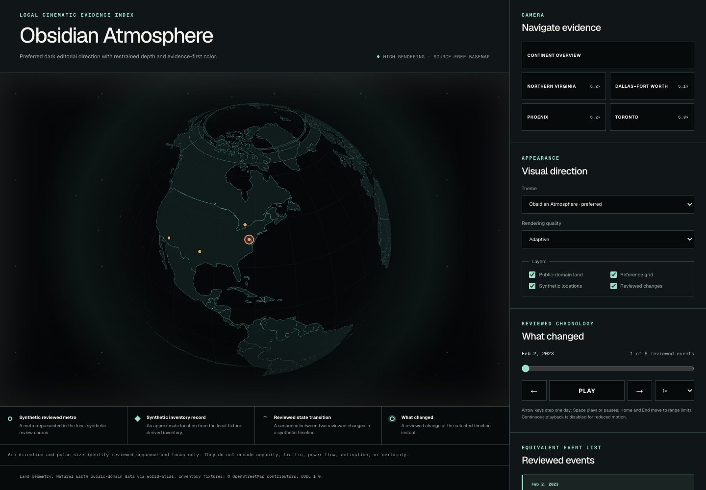
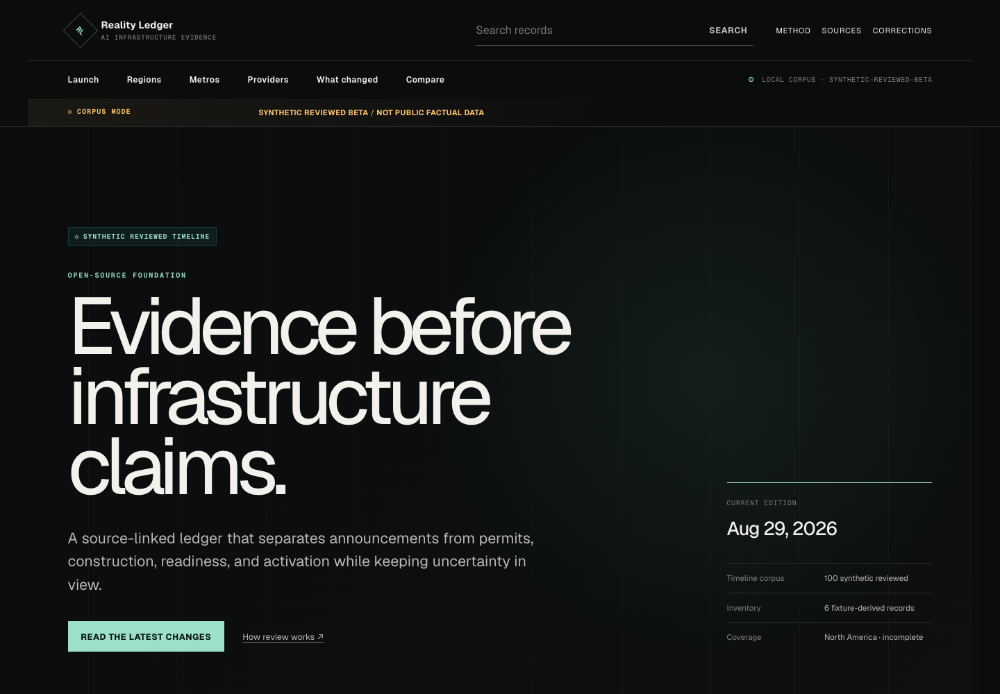
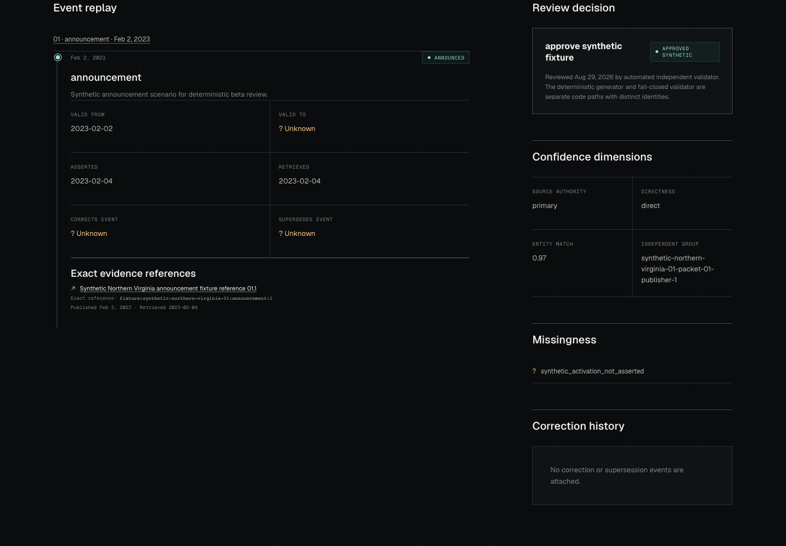

# AI Infrastructure Reality Ledger


**Public beta · synthetic demonstration corpus · Apache-2.0 code**

The bottom line: infrastructure maps become misleading when proposals, construction activity, and
operational capacity are treated as the same fact. The Reality Ledger keeps those states separate,
attaches evidence to material claims, and preserves uncertainty and corrections.

This repository is ready for local public-beta review. It is not an authoritative market dataset.
The checked-in beta contains a **six-record synthetic inventory** and **100 synthetic timelines**.
Those fixtures test the product and evidence model; they are **not real market coverage**.

## Live demo

- [Public launch experience](https://ai-infrastructure-reality-ledger.vercel.app/launch)
- [Source repository](https://github.com/Brianletort/ai-infrastructure-reality-ledger)

To run the same experience locally:

```bash
npm ci
uv sync --project apps/worker --frozen
npm run dev --workspace web
```

## What it does

- separates announced, construction, activation, contested, superseded, and corrected states;
- records valid, assertion, publication, and retrieval time independently;
- links claims to exact references and evidence packets;
- exposes source authority, directness, entity-match confidence, conflicts, and missing fields;
- treats redistribution rights as source-level data, not an afterthought;
- preserves correction lineage instead of silently rewriting history;
- provides a place-first globe, metro views, facility profiles, timelines, search, and comparison.

## Why it is different

The product is not the map. The product is the chain from a visible assertion back to its source,
review decision, rights classification, and revision history. A pin can be wrong in several ways:
the entity may be mismatched, the source may be weak, the lifecycle state may be overstated, or the
underlying material may not be redistributable. The ledger keeps those failure modes explicit.

## Evidence model

1. **Source:** publisher, exact reference, publication/retrieval time, and redistribution class.
2. **Claim:** a bounded assertion about an entity, event, relationship, or state.
3. **Evidence packet:** citations and signals with authority, directness, and entity-match measures.
4. **Review:** independence, checklist results, conflicts, explicit unknowns, and decision.
5. **Revision:** immutable supersession or correction links; no silent replacement.

Activation is deliberately harder than announcement. In the synthetic corpus, activation requires
at least two independent signals, an authoritative signal, and a non-imagery signal. See the
[methodology](docs/data/deep-metro-timelines.md) and
[evidence-platform architecture](docs/architecture/evidence-platform.md).

## Cinematic globe

The globe is a geographic index into evidence. It uses local land geometry, generalized coordinates,
deterministic scene data, three visual themes, keyboard-accessible controls, and a non-WebGL text
fallback. It does not use a remote basemap or imply site-level coordinate precision.



The checked-in headless render shows the repaired MapLibre and deck.gl scene. Projection and deck
overlay initialization now wait for style load, the icon atlas is same-origin, and the control
container remains visible. Read the [globe design and constraints](docs/ui/cinematic-globe.md).

## Current beta truth

| Checked-in artifact | What it is | What it is not |
| --- | --- | --- |
| 6 inventory records | Deterministic fixture-derived records across the US, Canada, and Mexico | A facility census |
| 100 timelines | 25 independently reviewed synthetic timelines in each of four test metros | Real facility or event history |
| 32 measured release gates | Local checks that passed in the latest gate run | Proof of production readiness |
| Real-GPU laptop | 120.00 FPS over 10,000.00 ms on scripted Chrome 151.0.0.0 / Apple M4 Pro | A mobile-performance claim |
| 1 inconclusive gate | Representative midrange mobile measurement remains open | A mobile-performance pass or failure |

The six records have generalized display coordinates. Capacity is unknown for all six; operator is
unknown for three. The timeline corpus is marked `SYNTHETIC REVIEWED BETA` and `NOT PUBLIC FACTUAL
DATA` throughout the data and interface.

## Screenshots and demo

| Home and coverage truth | Timeline and evidence |
| --- | --- |
|  |  |

- [Demo storyboard and reproducible sequence](docs/launch/demo-storyboard.md)
- [Verified headless demo video](docs/assets/launch/reality-ledger-demo.webm)
- Recreate every launch asset with `npm run launch:capture` after a production build.

Video status: **captured**. The 2.76 MB WebM contains a verified visible globe scene and persistent
synthetic warnings. The screenshots and video are local headless Chromium renders; every displayed
record remains synthetic. They demonstrate the product boundary, not the market.

## Quick start

Prerequisites: Node.js 22+, npm 10+, Python 3.12+, `uv`, and the pinned Playwright Chromium browser
for launch-asset capture.

```bash
npm ci
uv sync --project apps/worker --frozen
npm run lint
npm run typecheck
npm test
npm run python:lint
npm run python:typecheck
npm run python:test
npm run build
npm run dev --workspace web
```

Health checks:

```bash
curl --fail http://localhost:3000/
curl --fail http://localhost:3000/api/inventory?limit=1
uv run --project apps/worker python -c \
  "from reality_ledger_worker.health import get_worker_health; assert get_worker_health().status == 'ready'"
```

See the complete [self-hosting guide](docs/launch/self-hosting.md) for environment variables, data
refresh, optional components, backup/rollback, and troubleshooting.

## Architecture

```text
checked-in JSON ──> bounded repository layer ──> Next.js pages and read APIs
       ▲                                                │
       │                                                └──> local MapLibre scene
Python adapters ──> normalize ──> validate/review ──> versioned artifacts
       │
       └── optional future path: PostgreSQL/PostGIS + object storage + PMTiles
```

```text
apps/web             Next.js App Router application
apps/worker          Python 3.12+ asynchronous ingestion package
database             Optional PostgreSQL/PostGIS migrations
packages/domain      JSON Schemas and TypeScript types
packages/visuals     Local MapLibre scene and playback
packages/source-sdk  Public adapter contracts
docs                 Architecture, policy, operations, and contribution guidance
evaluations          Repeatable local release gates and evidence
```

Read the [architecture overview](docs/architecture/overview.md). Optional PostgreSQL/PostGIS, object
storage, PMTiles, and worker scale paths are documented but not provisioned. This repository contains
no IaC or production configuration.

## Source and license boundaries

Code is licensed under [Apache-2.0](LICENSE). Data and evidence can carry different rights. Each
source must be classified `republish`, `derived-only`, `link-only`, or `prohibited`; a public URL is
not sufficient permission to redistribute content.

- [Public data and source policy](docs/policy/public-data-and-sources.md)
- [Clean-room provenance](docs/policy/clean-room-provenance.md)
- [Third-party notices](THIRD_PARTY_NOTICES.md)
- [ODbL artifact notice](data/odbl/README.md)

This is a standalone clean-room project. Do not contribute employer, customer, competitor-
confidential, access-controlled, or otherwise restricted material.

## Contribution wedge

Start small:

1. submit a source request with publisher, URL, authority, terms, and intended redistribution class;
2. submit a correction report with the ledger identifier, proposed change, rationale, and evidence;
3. add a fixture-first source adapter only after its source and rights are reviewed.

Read [CONTRIBUTING.md](CONTRIBUTING.md), the
[source-adapter guide](docs/contributing/source-adapters.md), and
[synthetic contribution examples](docs/launch/synthetic-contribution-examples.md). All changes
require human review. Data, schema, dependency, security, performance, and production-impacting work
requires the gates stated in its task packet.

## Roadmap

The next work is evidence quality, not inflated coverage: replace synthetic records only with
approved public-source records, strengthen review tooling, measure representative GPU performance,
and prove operating controls before any production claim. See [ROADMAP.md](ROADMAP.md).

## Security

No third-party network calls run in page request paths. Local gates scan configured secret patterns,
unsafe code patterns, API bounds, dependency advisories, and public API field exposure. Passing
those checks is not full security verification. Report vulnerabilities privately through
[SECURITY.md](SECURITY.md).

## Correction workflow

Corrections are review packets, not direct external writes:

1. identify the exact ledger record and disputed field or claim;
2. provide the proposed correction, rationale, and supporting source;
3. review source rights, evidence strength, entity match, and downstream impact;
4. add a correction or supersession event while preserving prior history;
5. regenerate deterministic artifacts and rerun the release gates.

See the [correction policy](docs/policy/corrections.md).

## Methodology

- [North America inventory method](docs/data/north-america-inventory.md)
- [Deep-metro timeline method](docs/data/deep-metro-timelines.md)
- [Independent review playbook](docs/contributing/deep-metro-review-playbook.md)
- [Public-source replacement workflow](docs/contributing/public-source-replacement.md)
- [Local release evaluation gates](evaluations/README.md)

## Limitations

- The checked-in data is synthetic and deliberately incomplete.
- OpenStreetMap tagging is voluntary and uneven; presence does not establish operator, tenant,
  capacity, activation, or lifecycle state.
- Coordinates are generalized to 0.01 degree and cannot support site-precision use.
- The representative laptop real-GPU gate passed with scripted Chrome 151.0.0.0 on the Apple M4
  Pro Metal renderer, route `/globe?theme=obsidian`, matching `/globe` runtime fingerprint,
  1199 × 792 overlay/canvas geometry, 1,200 frames over 10,000.00 ms, 120.00 FPS, and bound globe
  PNG/demo WebM hashes. Representative midrange mobile performance remains unmeasured and
  inconclusive.
- Configured local security checks do not establish production security.
- No public hosting, operational ingestion, production database, uptime, adoption, accuracy, or
  market-coverage claim exists.
- The working name has no exact collision in the search recorded for this task, but that is not
  trademark clearance. Branding remains a release approval item.

## Release status

The local package remains an approval candidate. External publication is intentionally withheld.
See the [public-beta release notes](docs/launch/public-beta-release-notes.md) and
[Tier-3 external-release checklist](docs/contributing/release-checklist.md).
