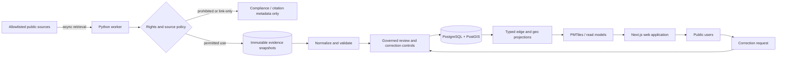

# Architecture overview

## System intent

The Reality Ledger separates asynchronous evidence acquisition from deterministic public reads.
PostgreSQL with PostGIS is the system of record. Typed relationship tables preserve graph semantics
without introducing a second operational database before query evidence justifies it.

The web application reads only governed ledger projections and prebuilt geospatial artifacts. It
does not fetch third-party data during a request. The worker retrieves allowlisted public sources,
classifies redistribution rights, stores immutable evidence snapshots, and proposes normalized
records for validation and human-governed publication.

The checked-in deep-metro read model is a deterministic reviewed synthetic beta corpus: 25
timelines each for Northern Virginia, Dallas–Fort Worth, Phoenix, and Toronto. It contains no
public factual timeline. Its official-source configurations are manual/link-only landing-page
records until separately verified machine endpoints and Tier-2 approvals exist.

## Component boundaries

- **Web:** public exploration, evidence inspection, and correction intake.
- **Worker:** asynchronous retrieval, hashing, parsing, normalization, and publication jobs.
- **Domain:** technology-neutral schemas and TypeScript contracts.
- **Source SDK:** connector interfaces and provenance metadata contracts.
- **Graph:** typed edge projection and traversal logic.
- **Geo:** PostGIS queries and PMTiles generation.
- **Visuals:** MapLibre base maps, deck.gl analytical layers, and optional React Three Fiber scenes.
- **UI:** shared accessible presentation primitives.

## Data flow

## Trust boundaries

Source content is untrusted input. Retrieval workers, parsers, snapshot storage, the system of
record, generated read models, and the public web tier are separate trust zones. Publication
requires schema validation and policy checks. Evidence is append-only; corrections supersede or
annotate prior assertions rather than mutating history invisibly.

## Initial deployment posture

The repository includes local migrations, ingestion primitives, and synthetic read models. It
creates no cloud account, production database, network allowlist, storage bucket, or deployment
pipeline. Those are Tier-2 or Tier-3 decisions that require explicit approval and threat-model
updates. See [Evidence-platform architecture](evidence-platform.md) for the implemented boundaries.
